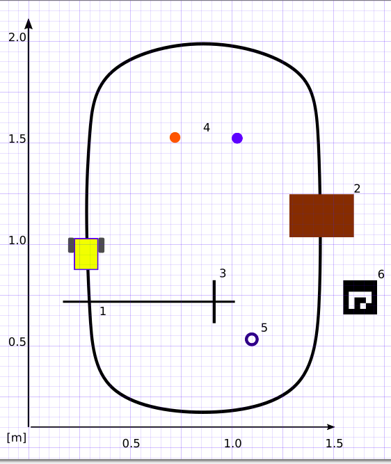

# BDS-Missions 
### Authors

**By Dennis Jensen s155629, Martin Jensen s164033, Theis Munk Jensen s164022, & Stefan M. Carius Larsen s164029**

### Compiling and running the code

For compiling and running the code one must install the MQTT library in addition to libraries used in 31386 Building Dependable Robot Systems.

The MQTT library is installed using the following command in a Linux terminal:

```bash
$ sudo apt-get install mosquitto mosquitto-dev mosquitto-clients
```


### Outline

This repository holds the source code for completing a mission track with the robot sally.

The file umission.cpp is file containing all the mission sequences.

The file findball.cpp contains the algorithms for finding balls.

The file cloud_process.cpp contains the communication protocols for doing cloud processing with neural nets.

Beneath is an image of the track

